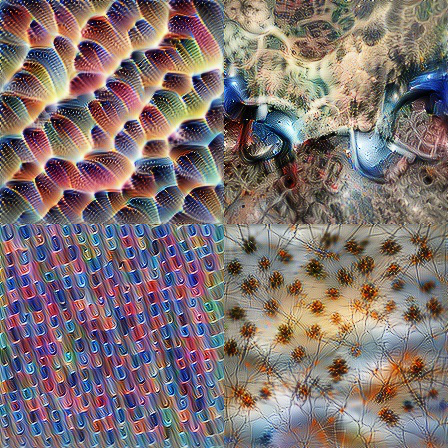

# Conveiro

Conveiro (convolutional + oneiro, Greek for "dream") is an open source library for feature visualization in deep convolutional networks. It implements multiple techniques for visualization, such as laplace, multiscale,  deep dream and CDFS.

All of these methods are based on:

### Deep dream

Deep dream is implementation of technique based on

  * https://github.com/tensorflow/tensorflow/blob/master/tensorflow/examples/tutorials/deepdream/deepdream.ipynb
* https://ai.googleblog.com/2015/06/inceptionism-going-deeper-into-neural.html

If you don't want to read it and want short explenation here it is. 
* We create random image (or we can use seed image)
* We feed this image to network and optimize it based on calculated gradients
* We employ few clever tricks based on scaling and frequencies

There are few more steps but this is the essence of this technique.  

### CDFS
CDFS (color-decorrelated fourier space) is custom implementation of technique based on
* https://distill.pub/2017/feature-visualization/
* https://github.com/tensorflow/lucid

If you don't want to read it and want short explenation here it is. 
* We generate random complex coefficient
* We use said coefficients to generate image by inverse fourier transformation
*  After we feed this image to network we can calculate gradients and use gradient descent to optimize these coefficient

There are few more steps but this is the essence of this technique.

## Requirements

* Python 3.4 and above
* Tensorflow (CPU or GPU variant)
* Numpy
* Matplotlib

## Installation

```
pip install conveiro
```

Development version

```
pip install -e .    # from cloned repository
```

## Examples

For examples how to use this library please take a look at jupyter notebooks in `docs/` folder:

* https://github.com/Showmax/conveiro/tree/master/docs/deep_dream.ipynb
* https://github.com/Showmax/conveiro/tree/master/docs/cdfs.ipynb

Simplest example:

```python
import tensorflow as tf
import tensornets as nets
from conveiro import cdfs

input_t, decorrelated_image_t, coeffs_t = cdfs.setup(224)

model = nets.Inception1(input_t)
graph = tf.get_default_graph()

with tf.Session() as sess:
    sess.run(model.pretrained())

    objective = graph.get_tensor_by_name("inception1/block3b/concat:0")
    image = cdfs.render_image(sess, decorrelated_image_t, coeffs_t, objective[..., 55], 0.01)
    cdfs.show_image(cdfs.process_image(image))
```



**Note** The API is preliminary and may change in future versions.
